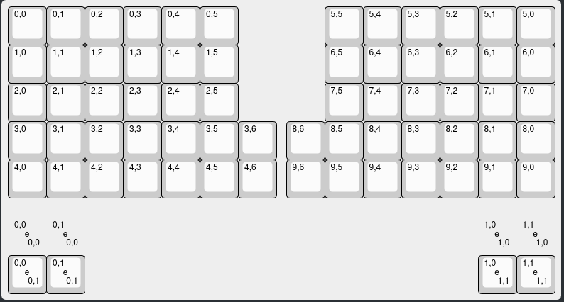
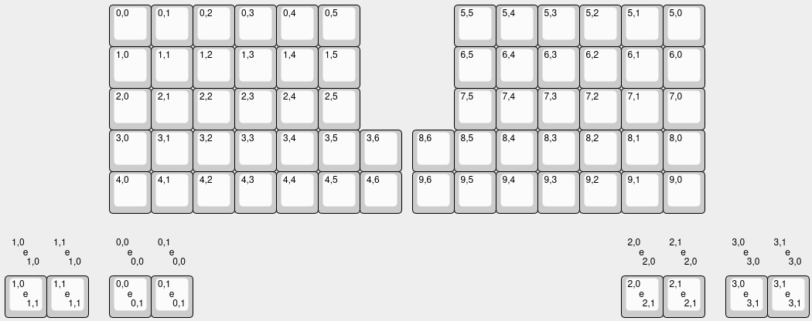
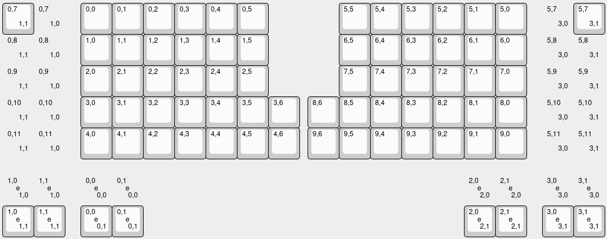

# Porting a Keyboard for Halcyon Module Support

Ensure the setup in the main [README](README.md) is completed before proceeding.

This guide applies to:

* Keyboards with a **Halcyon + VIK connector**
* Keyboards using the **Halcyon → Pro Micro adapter**

## 1. Enable Halcyon Modules in Your Keymap

Copy or create your keymap in this repository.

In your keymap directory, update or create `rules.mk`:

```make
USER_NAME := halcyon_modules
```

If using the Halcyon → Pro Micro adapter, also add:

```make
CONVERT_TO = halcyon
```

## 2. Configure Encoder Support

Edit:

```
users/halcyon_modules/splitkb/config.h
```

Add a keyboard-specific override. Pin values must match those defined in `keyboard.json`.

Replace `/` with `_` in the keyboard identifier:  
*(If you're unsure what the exact `keyboard_name` is, you can run `qmk list-keyboards | grep <keyboard>`)*

```c
#ifdef KEYBOARD_splitkb_halcyon_elora_rev2
    #define ENCODER_A_PINS { GP22, HLC_ENCODER_A }
    #define ENCODER_B_PINS { GP18, HLC_ENCODER_B }
#endif
```

If the keyboard defines a split encoder, also override right-half pins:

```c
#ifdef KEYBOARD_splitkb_aurora_corne_rev1
    #define ENCODER_A_PINS { D4, HLC_ENCODER_A }
    #define ENCODER_B_PINS { C6, HLC_ENCODER_B }

    #undef ENCODER_A_PINS_RIGHT
    #undef ENCODER_B_PINS_RIGHT
    #define ENCODER_A_PINS_RIGHT { F6, HLC_ENCODER_A }
    #define ENCODER_B_PINS_RIGHT { F7, HLC_ENCODER_B }
#endif
```

## 3. Expand the Matrix

In your keymap's `config.h`, override the column count when Halcyon is enabled. Create the file if needed.

Determine the current column count by counting the number of pins from `keyboard.json`, then add 5:

```c
#undef MATRIX_COLS
#define MATRIX_COLS 11  // original + 5
```

## 4. Define Halcyon Button Mappings

Update `keymap.c`, or create a new file if you're using the `keymap.json` (e.g. `halcyon_keys.c`).

If creating a new file:

* Add `#include QMK_KEYBOARD_H`
* Register it in `rules.mk`:

  ```make
  SRC += halcyon_keys.c
  ```

Add:

```c
#if defined(HALCYON_ENABLE)

const uint16_t left_halcyon_buttons[10][5] = {
    [0] = { KC_MUTE, _______, _______, _______, _______ },
    [1] = { _______, _______, _______, _______, _______ },
    [2] = { _______, _______, _______, _______, _______ },
};

const uint16_t right_halcyon_buttons[10][5] = {
    [0] = { KC_MUTE, _______, _______, _______, _______ },
    [1] = { _______, _______, _______, _______, _______ },
    [2] = { _______, _______, _______, _______, _______ },
};

#endif
```

(Extend layers as needed; unused entries can remain `_______`.)


## 5. Add extra encoder mapping

Update the keymap to include two extra encoder mappings. Extend layers as needed.

For a `keymap.json`:
```json
    "encoders": [
        [{"ccw": "KC_VOLD", "cw": "KC_VOLU"}, {"ccw": "KC_VOLD", "cw": "KC_VOLU"}, {"ccw": "KC_PGUP", "cw": "KC_PGDN"}, {"ccw": "KC_PGUP", "cw": "KC_PGDN"}],
        [{"ccw": "_______", "cw": "_______"}, {"ccw": "_______", "cw": "_______"}, {"ccw": "_______", "cw": "_______"}, {"ccw": "_______", "cw": "_______"}],
        [{"ccw": "_______", "cw": "_______"}, {"ccw": "_______", "cw": "_______"}, {"ccw": "_______", "cw": "_______"}, {"ccw": "_______", "cw": "_______"}],
    ],
```

For a `keymap.c`:
```c
#if defined(ENCODER_MAP_ENABLE)
const uint16_t PROGMEM encoder_map[][NUM_ENCODERS][NUM_DIRECTIONS] = {
    [0] = { ENCODER_CCW_CW(KC_VOLD, KC_VOLU),  ENCODER_CCW_CW(KC_VOLD, KC_VOLU),  ENCODER_CCW_CW(KC_PGUP, KC_PGDN),  ENCODER_CCW_CW(KC_PGUP, KC_PGDN)  },
    [1] = { ENCODER_CCW_CW(_______, _______),  ENCODER_CCW_CW(_______, _______),  ENCODER_CCW_CW(_______, _______),  ENCODER_CCW_CW(_______, _______)  },
    [2] = { ENCODER_CCW_CW(_______, _______),  ENCODER_CCW_CW(_______, _______),  ENCODER_CCW_CW(_______, _______),  ENCODER_CCW_CW(_______, _______)  },
};
#endif
```

## 6. Compile

Build using the standard userspace workflow described in the main [README](README.md).


# Adding Support for Vial

A keymap from the Vial repository works without modification.  
To enable Halcyon button mappings, set:

#define HALCYON_BUTTONS_ENABLE

If you want these buttons or encoders to be configurable in Vial, you must update `vial.json`. 

> **Note:** These are general guidelines, the full integration might be different depending on how a keyboard is made up. Feel free to create an issue, ask in our discord or send an email to support@splitkb.com if you're having any issues.

## 1. Expand Matrix

Increase the column count in `vial.json` by 5.

## 2. Update Layout in KLE

Copy the `keymap` contents into:
https://editor.keyboard-tools.xyz/

Click “Apply Changes” to refresh the layout preview.

## 3. Add Encoder Definitions

If the keyboard already defines encoders:

- Increment the index of the right encoder by 1 to account for the new encoders
- Add two additional encoders by duplicating the existing encoder entries

Before:  


After:  


> **Tip:** You can copy and paste between layouts. For example, open a known working `vial.json` (such as the Aurora Helix), copy the encoder section, and adjust indices as needed.

## 4. Add Halcyon Button Columns

Add a new column starting from the last existing column.

Example (Helix):
- Existing columns end at `6`
- Start new column at `0,7`

Steps:
- Add a button at `0,7`
- Set bottom-right label to `1,0` and enable `decal`
- Duplicate this button
- Change label to `1,1`
- Disable `decal` on the first button

Repeat for the right half:
- Start at `5,7` (based on first row of right side)
- Use labels:
  - First column: `3,0`
  - Second column: `3,1`

Using this method add a total of 5 buttons as shown in the image below.

After:  


Note: Additional buttons are currently inactive and reserved for future modules.

## 5. Apply Changes

Copy the updated layout back into `vial.json`.

## 6. Update Layout Labels

Set the `labels` field as follows:

```json
"labels": [
    "Soldered encoder left",
    [
        "Halcyon module left",
        "None",
        "Encoder"
    ],
    "Soldered encoder right",
    [
        "Halcyon module right",
        "None",
        "Encoder"
    ]
]
```
